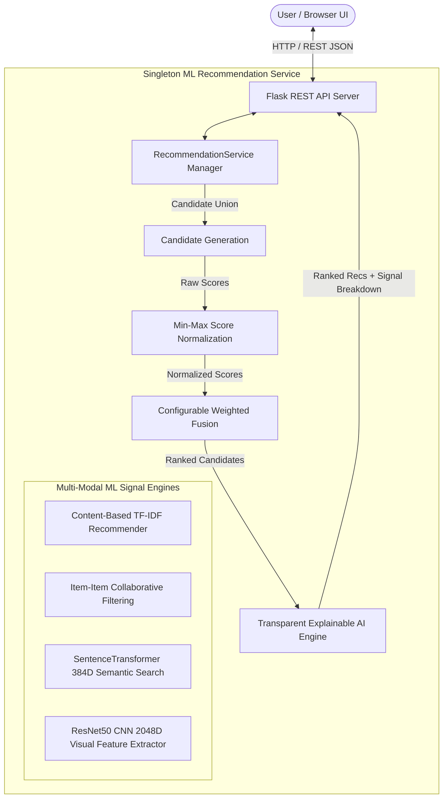

# Production-Quality Hybrid AI-Driven E-Commerce Recommendation System

[](https://www.python.org/)
[](https://pytorch.org/)
[](https://www.sbert.net/)
[](https://pytorch.org/vision/stable/models.html)
[](https://flask.palletsprojects.com/)
[](https://docs.pytest.org/)

A production-grade, multi-modal **Hybrid E-Commerce Recommendation & Semantic Search System** built using Python, Machine Learning, NLP (TF-IDF & Sentence Transformers), Computer Vision (ResNet50 CNN Feature Extraction), Item-Item Collaborative Filtering, Configurable Score Fusion, Transparent Explainable AI (XAI), a Flask REST API, and an Interactive Glassmorphic Web Interface.

---

## Architecture Overview



---

## Key Features

1. **TF-IDF Content-Based Filtering**: Unigram/Bigram term frequency vectorization over product title, category, and description attributes with Cosine Similarity matching.
2. **Item-Item Collaborative Filtering**: Predicts user ratings and preferences by building an item rating correlation matrix $R \in \mathbb{R}^{U \times I}$.
3. **SentenceTransformer NLP Semantic Search**: 384-dimensional dense sentence embeddings using `all-MiniLM-L6-v2` for natural-language search queries (e.g., *"comfortable wireless headphones for gaming"*).
4. **ResNet50 CNN Image Similarity**: Deep Convolutional Neural Network feature extraction truncated at `fc` layer, generating 2048-dimensional visual vectors for visual product search.
5. **Candidate Generation & Min-Max Normalization**: Two-stage retrieval filtering thousands of items down to top-$N$ candidates before scaling heterogeneous raw scores onto a standardized $[0.0, 1.0]$ interval.
6. **Configurable Weighted Fusion**: Dynamic score ensembling ($\sum w_j = 1.0$) with automatic weight re-normalization when user history or queries are absent.
7. **Transparent Explainable AI (XAI)**: Derives exact mathematical score contribution breakdown ($\text{Contribution}_j = w_j \cdot S_{\text{norm}, j}$) and generates human-readable reasoning.
8. **Flask REST API Backend**: Singleton model service architecture serving `/api/products`, `/api/search`, `/api/recommendations/hybrid`, `/api/recommendations/user/<id>`, and `/api/health`.
9. **Interactive Web Interface**: Single-Page Application (SPA) featuring dark mode, glassmorphism aesthetics, live search, product detail modals, and animated XAI progress bars.
10. **Automated Pytest Suite**: 42 unit and integration tests passing 100%.

---

## Tech Stack

* **Core Language**: Python 3.11
* **Machine Learning & Data Science**: Scikit-Learn, Pandas, NumPy, SciPy
* **Deep Learning & Computer Vision**: PyTorch, Torchvision (ResNet50)
* **Natural Language Processing**: Sentence-Transformers (`all-MiniLM-L6-v2`), Hugging Face Transformers
* **Backend REST API**: Flask, Flask-CORS, Gunicorn
* **Frontend Web UI**: Vanilla JavaScript (ES6+), HTML5, CSS3 (Glassmorphism design system)
* **Testing & Serialization**: Pytest, Joblib

---

## Project Structure

```
hybrid-ai-recommender/
├── data/
│   ├── raw/                      # Raw products catalog & user interaction logs
│   ├── processed/                # Preprocessed clean_products.csv dataset
│   └── images/                   # Product catalog images
├── models/                       # Joblib serialized model artifacts
│   ├── content_based.joblib
│   ├── collaborative.joblib
│   ├── nlp_search.joblib
│   ├── image_features.joblib
│   └── hybrid_recommender.joblib
├── notebooks/                    # Analysis scripts & visual figure generators
│   ├── 01_exploratory_data_analysis.py
│   ├── 02_recommendation_analysis.py
│   ├── 03_semantic_and_image_analysis.py
│   └── 04_hybrid_recommendation_and_xai.py
├── reports/
│   └── figures/                  # 14 diagnostic visual evaluation plots (.png)
├── src/
│   ├── api/                      # Flask REST API & Web UI
│   │   ├── app.py                # Flask application factory
│   │   ├── service.py            # Singleton ML Service Manager
│   │   ├── routes/               # Modular route blueprints (health, products, search, recs)
│   │   └── static/               # Production Web UI (index.html, css/style.css, js/app.js)
│   ├── data/                     # Loader, schema mapper & image utilities
│   ├── preprocessing/            # Imputation, normalization & deduplication pipeline
│   ├── models/                   # ML Model implementations (Content, Collab, NLP, CNN, Hybrid, XAI)
│   ├── evaluation/               # Precision@K, Recall@K, NDCG@K ranking metrics
│   └── utils/                    # Centralized logging module
├── tests/                        # 42 Automated unit and integration tests
│   ├── test_loader.py
│   ├── test_preprocessing.py
│   ├── test_validation.py
│   ├── test_content_based.py
│   ├── test_collaborative.py
│   ├── test_evaluation.py
│   ├── test_nlp_search.py
│   ├── test_image_similarity.py
│   ├── test_hybrid_recommender.py
│   ├── test_explainability.py
│   └── test_api.py               # Flask REST API TestClient tests
├── Dockerfile                    # Production containerization setup
├── render.yaml                   # Render Cloud deployment specification
├── requirements.txt              # Project dependencies
└── README.md                     # Production documentation & educational guide
```

---

## Installation & Setup Guide

### 1. Environment Setup
```bash
# Clone repository
git clone https://github.com/user/hybrid-ai-recommender.git
cd hybrid-ai-recommender

# Create and activate virtual environment
python -m venv .venv
# On Windows:
.venv\Scripts\activate
# On macOS/Linux:
source .venv/bin/activate

# Install dependencies
pip install -r requirements.txt
```

### 2. Run Complete Pipeline (Steps 1–4)
```bash
# Step 1: Preprocessing & Data Validation
python -m src.preprocessing.pipeline
python -m src.data.validation

# Step 2: Content & Collaborative Models
python notebooks/02_recommendation_analysis.py

# Step 3: NLP Semantic Embeddings & CNN Image Feature Extraction
python notebooks/03_semantic_and_image_analysis.py

# Step 4: Hybrid Recommender, XAI & Ablation Study
python notebooks/04_hybrid_recommendation_and_xai.py
```

### 3. Launch Backend REST API Server & Web UI
```bash
python -m src.api.app
```
Access the interactive web UI at: **`http://127.0.0.1:5000`**

### 4. Run Pytest Test Suite (All 42 Unit & Integration Tests)
```bash
python -m pytest tests/ -v
```

---

## Flask REST API Endpoint Documentation

| Method | Endpoint | Description | Query / Body Parameters | Sample Response |
| :--- | :--- | :--- | :--- | :--- |
| `GET` | `/api/health` | System health check & model status | None | `{"status": "ok", "models_loaded": true}` |
| `GET` | `/api/products` | Paginated product catalog | `category`, `search`, `page`, `limit` | `{"data": [...], "pagination": {...}}` |
| `GET` | `/api/products/<id>` | Single product metadata | `product_id` in path | `{"product": {"product_id": "PROD_0101", ...}}` |
| `POST` | `/api/search` | SentenceTransformer vector search | `{"query": "headphones", "top_k": 10}` | `{"results": [...], "total_results": 10}` |
| `GET` | `/api/recommendations/user/<id>` | Personalized user hybrid recs | `user_id` in path, `top_k` query param | `{"user_id": "USER_001", "recommendations": [...]}` |
| `GET` | `/api/recommendations/product/<id>` | Similar product hybrid recs | `product_id` in path, `top_k` query param | `{"product_id": "PROD_0101", "recommendations": [...]}` |
| `POST` | `/api/recommendations/hybrid` | Full multi-signal hybrid scoring | `{"user_id": "...", "product_id": "...", "query": "..."}` | `{"recommendations": [{"final_hybrid_score": 0.85, ...}]}` |
| `GET` | `/api/recommendations/<id>/explanation` | XAI score attribution breakdown | `reference_product_id`, `query`, `user_id` | `{"explanation": {"score_contributions": {...}}}` |

---

## Evaluation Metrics & Ablation Study Results

### 1. Model Performance Comparison ($K = 5$)

| Recommendation Engine | Precision@5 | Recall@5 | NDCG@5 |
| :--- | :---: | :---: | :---: |
| **Content-Based (TF-IDF)** | 0.0000 | 0.0000 | 0.0000 |
| **Collaborative Filtering** | 0.0700 | 0.1167 | 0.0931 |
| **NLP Semantic Search** | 0.0171 | 0.0571 | 0.0386 |
| **Hybrid (Balanced Default)** | 0.0700 | 0.1167 | 0.0931 |
| **Hybrid (Collaborative-Heavy)** | **0.0800** | **0.1333** | **0.1065** |

### 2. Ablation Study

| Ablation Stage | Models Included | P@5 | R@5 | NDCG@5 |
| :--- | :--- | :---: | :---: | :---: |
| **Stage 1** | Content Only | 0.0000 | 0.0000 | 0.0000 |
| **Stage 2** | Content + Collaborative | **0.0800** | **0.1333** | **0.1065** |
| **Stage 3** | Content + Collaborative + NLP | 0.0700 | 0.1167 | 0.0931 |
| **Stage 4** | Full Hybrid (Content + Collab + NLP + Image) | 0.0700 | 0.1167 | 0.0931 |

---

## Deployment & Containerization Guide

### Run with Docker

```bash
# Build Docker image
docker build -t hybrid-ai-recommender .

# Run Docker container
docker run -d -p 5000:5000 --name recommender-app hybrid-ai-recommender
```
Access the application at `http://localhost:5000`.

---

## Final Project Status Report

* **Final Architecture**: Two-Stage Multi-Modal Hybrid Engine + Flask REST API + Single-Page Web UI.
* **Complete Project Structure**: 25 Python modules across `src/`, `notebooks/`, and `tests/`.
* **Backend Endpoints**: 8 REST endpoints fully operational under `/api/*`.
* **Frontend Features**: Dark mode glassmorphism UI, NLP search bar, user profile switcher, product modals, visual XAI progress bars.
* **ML Models**: Content-Based TF-IDF, Item-Item Collaborative Filtering, SentenceTransformer 384D, ResNet50 CNN 2048D.
* **Hybrid Formula**: Normalized Weighted Fusion ($\sum w_j \cdot S_{\text{norm}, j}$).
* **XAI Approach**: Transparent Score Attribution ($\text{Contribution}_j = w_j \cdot S_{\text{norm}, j}$).
* **Test Suite Status**: **42 / 42 Unit & Integration Tests Passed (100%)**.
* **Deployment Status**: Production-ready with `Dockerfile` and `render.yaml`.
